# AMP 2.0 Reference Architecture: Multi-Agent LLM System

## Table of Contents

1. [Executive Summary](#executive-summary)
2. [Document Guide](#document-guide)
3. [User Scenarios & Workflows](#user-scenarios--workflows)
4. [Agent System Architecture](#agent-system-architecture)
5. [Infrastructure Overview](#infrastructure-overview)
6. [Authentication & Session Management](#authentication--session-management)
7. [API Architecture](#api-architecture)
8. [Scaling Configuration](#scaling-configuration)
9. [Data Organization](#data-organization)
10. [Infrastructure Status](#infrastructure-status)
11. [Model Integration](#model-integration)
12. [Security & Performance](#security--performance)
13. [Data Flow Summary](#data-flow-summary)
14. [Multi-Account Data Flow](#multi-account-data-flow)
15. [AWS Framework Integration](#aws-framework-integration)
16. [Future-State Architecture](#future-state-architecture)

---

## Executive Summary

AMP 2.0 is a multi-agent architecture for enterprise AI chat and file workflows. The system supports multiple LLMs with session management, file processing, and context assembly across distributed agents.

## Document Guide

- **Mindmaps**: Agent responsibilities and relationships
- **Node diagrams**: Service interactions and data flow
- **Sequence diagrams**: End-to-end user and backend workflows
- **Tables**: Infrastructure and scaling configurations

All diagrams reference resources defined in [Infrastructure.md](INFRASTRUCTURE.md).

## User Scenarios & Workflows

### 1. Chat with File & Model Selection

User selects AI model, attaches files, sends message. Backend routes to selected model, processes files, streams response.

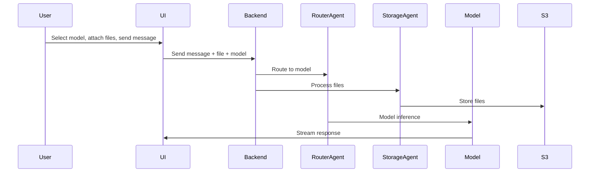

### 2. Chat with Data Source & Model Selection

User selects data source and AI model, sends message. Backend fetches data, assembles context, routes to model.

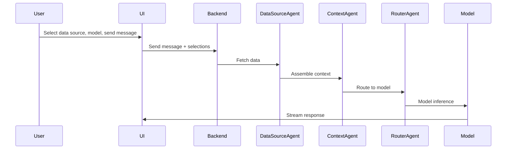

### 3. Workspace Collaboration

Multiple users join workspace, share documents. Session agent manages access, context agent assembles shared context.

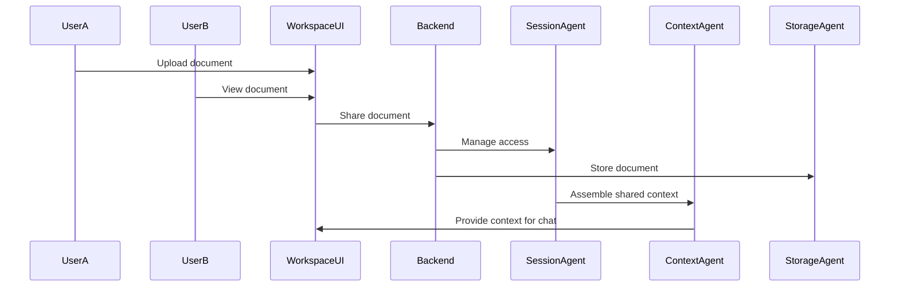

### 4. Agent Creation & Selection

User configures agents from UI. Agents are registered and available for selection.

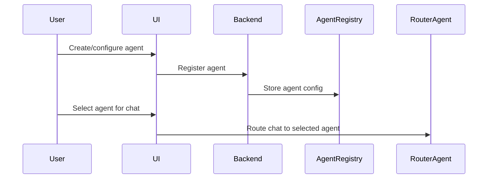

## Agent System Architecture

### Agentic Principles

- Each agent is a stateless, independently scalable microservice
- Agents communicate via APIs, events, or queues
- Strict API contracts and error handling between agents
- Extensible registry for adding new agents/models

### Agent Types Overview

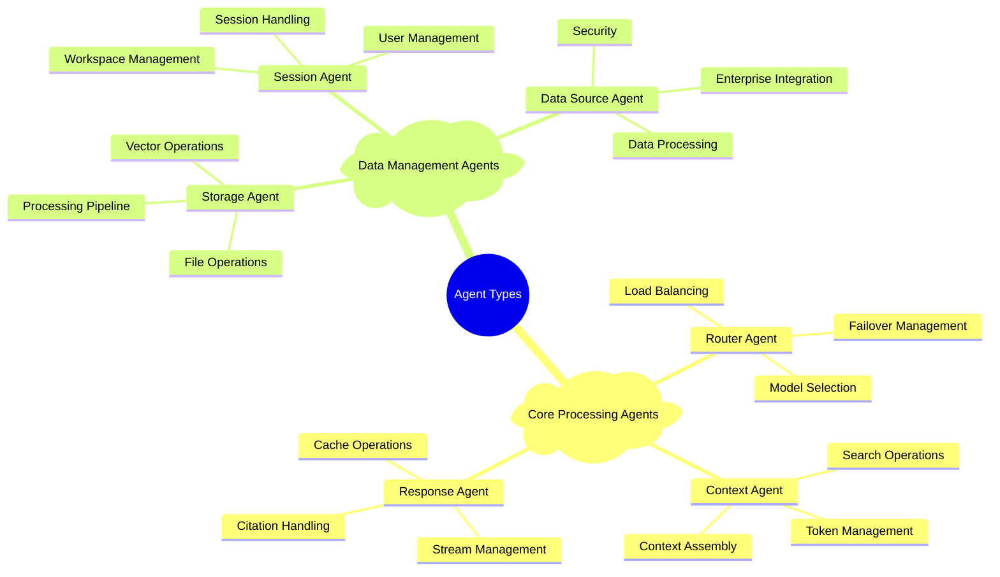

### Backend Account Architecture

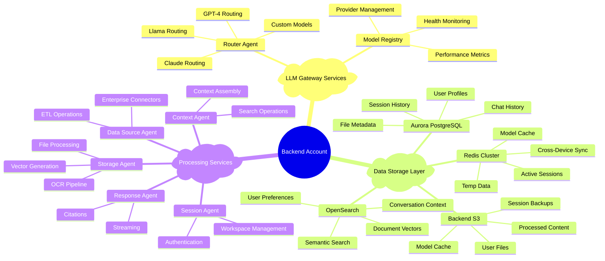

### Agent System Integration

The AMP 2.0 agent system orchestrates AI workflows through specialized agents:

- **User Context Management**: Session Agent maintains user state and preferences across devices. Context Agent assembles chat history and user-specific context for personalized responses.

- **Chat with Files**: Storage Agent processes uploaded files through OCR and chunking pipelines, generates embeddings, stores vectors in OpenSearch. Context Agent retrieves relevant file content during conversations.

- **Chat with Data Sources**: Data Source Agent connects to enterprise systems, performs ETL operations, provides real-time data access. Context Agent integrates external data with user context.

- **Chat with Agents**: Router Agent selects optimal LLM based on query type and performance requirements, manages failover and load balancing across model providers.

- **LightLLM Processing**: Agents coordinate through LLM Gateway where Context Agent assembles multi-source context, Router Agent selects model, Response Agent handles streaming and citations.

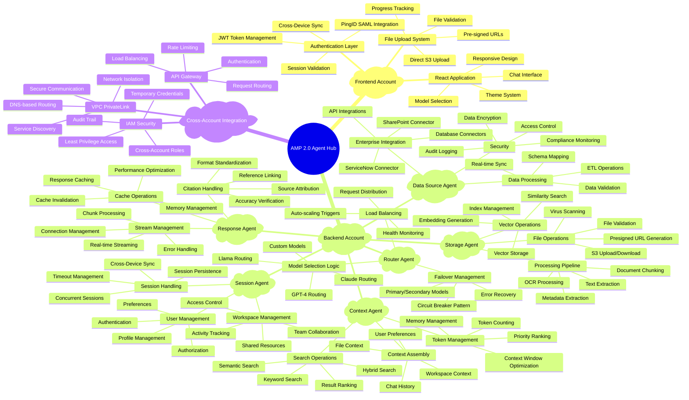

### Architecture Best Practices

- **Stateless Agents**: Auto-scalable microservices (ECS clusters)
- **API Contracts**: Strict versioning for agent communication
- **Event-Driven**: Async processing for file and chat workflows (Lambda, SQS)
- **Monitoring**: Centralized logging and alerting (CloudWatch, GuardDuty)
- **Security**: End-to-end encryption and IAM least privilege (KMS, IAM roles)
- **Extensibility**: Model and agent registry for future-proofing (LLM Gateway)
- **Cross-Account**: Secure isolation and independent scaling
- **Performance**: Real-time streaming and parallel processing
- **Compliance**: Comprehensive audit logging and access control

## Infrastructure Overview

### Account Structure

| Account | Purpose | Key Resources |
|---------|---------|---------------|
| Frontend | UI, File Upload, Session Mgmt | ECS Cluster, S3 Bucket, ALB, Redis |
| Backend | AI/LLM, Data, Vector, Security | ECS Cluster, Aurora, OpenSearch, S3 |

### High-Level Architecture

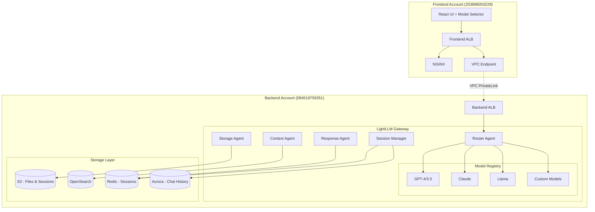

## Authentication & Session Management

### Authentication & Token Flow

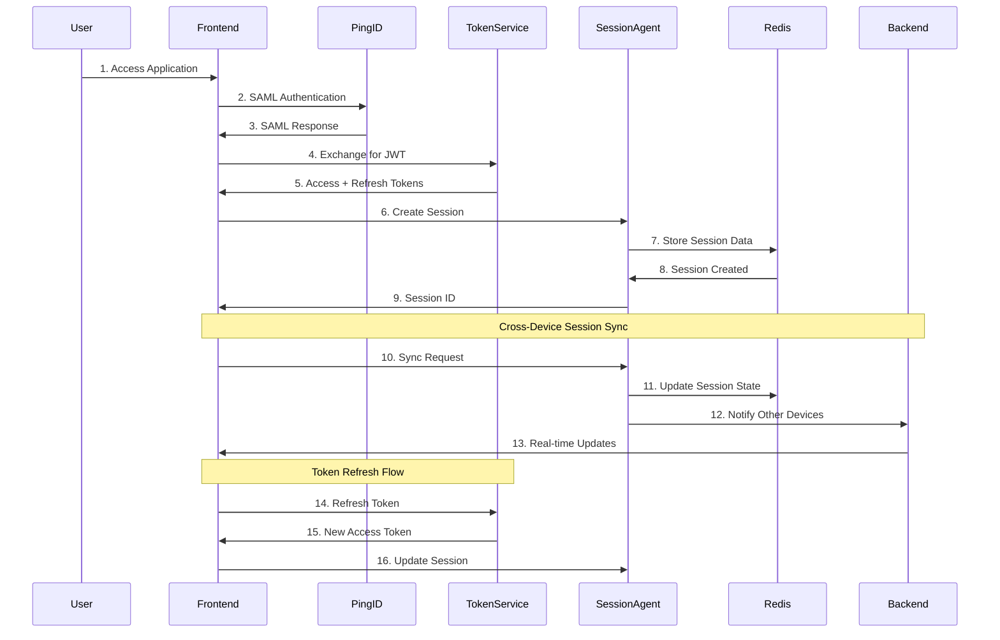

### Backend Agent Intelligence System

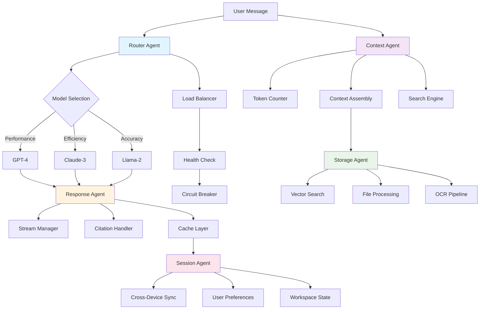

## API Architecture

### Complete API Endpoint Architecture

```mermaid
graph TB
    subgraph "Frontend Account"
        A1[Authentication APIs]
        A1 --> A11[POST /auth/login]
        A1 --> A12[POST /auth/refresh]
        A1 --> A13[GET /auth/verify]
        A1 --> A14[DELETE /auth/logout]
        
        S1[Session APIs]
        S1 --> S11[POST /session/create]
        S1 --> S12[GET /session/current]
        S1 --> S13[POST /session/sync]
        S1 --> S14[PUT /session/update]
        
        F1[File APIs]
        F1 --> F11[POST /files/upload-urls]
        F1 --> F12["GET /files/{id}/status"]
        F1 --> F13[POST /files/validate]
        F1 --> F14["DELETE /files/{id}"]
    end
    
    subgraph "Backend Account"
        C1[Chat APIs]
        C1 --> C11[POST /chat/send]
        C1 --> C12[GET /chat/stream]
        C1 --> C13[POST /chat/stop]
        
        M1[Model APIs]
        M1 --> M11[GET /models/available]
        M1 --> M12["GET /models/{id}/status"]
        M1 --> M13[POST /models/select]
        
        V1[Conversation APIs]
        V1 --> V11[GET /conversations]
        V1 --> V12[POST /conversations]
        V1 --> V13["GET /conversations/{id}"]
        V1 --> V14["DELETE /conversations/{id}"]
    end
    
    subgraph "Agent System APIs"
        R1[Router Agent]
        R1 --> R11[GET /agents/router/status]
        R1 --> R12[POST /agents/router/balance]
        R1 --> R13[GET /agents/router/metrics]
        
        ST1[Storage Agent]
        ST1 --> ST11[POST /agents/storage/process]
        ST1 --> ST12[GET /agents/storage/jobs]
        ST1 --> ST13[POST /agents/storage/search]
        
        SE1[Session Agent]
        SE1 --> SE11[GET /agents/session/status]
        SE1 --> SE12[POST /agents/session/sync]
        SE1 --> SE13[GET /agents/session/devices]
        
        CT1[Context Agent]
        CT1 --> CT11[POST /agents/context/assemble]
        CT1 --> CT12[GET /agents/context/tokens]
        CT1 --> CT13[POST /agents/context/search]
        
        RS1[Response Agent]
        RS1 --> RS11[GET /agents/response/stream]
        RS1 --> RS12[POST /agents/response/citations]
        RS1 --> RS13[GET /agents/response/cache]
    end
    
    subgraph "Cross-Account Security"
        IAM[IAM Cross-Account Roles]
        VPC[VPC PrivateLink]
        JWT[JWT Token Validation]
    end
    
    A1 -.->|Secure| C1
    S1 -.->|PrivateLink| SE1
    F1 -.->|IAM Role| ST1
    
    style A1 fill:#e3f2fd
    style S1 fill:#e8f5e8
    style F1 fill:#fff3e0
    style C1 fill:#fce4ec
    style M1 fill:#f3e5f5
    style V1 fill:#e0f2f1
```

## Scaling Configuration

### Agent Auto-Scaling

| Agent | Min Tasks | Max Tasks | Scaling Trigger |
|-------|-----------|-----------|-----------------|
| Router Agent | 20 | 100 | Request volume |
| Storage Agent | 30 | 150 | File processing queue |
| Session Agent | 10 | 50 | Active sessions |
| Context Agent | 20 | 80 | Search operations |
| Response Agent | 40 | 200 | Streaming connections |
| Data Source Agent | 5 | 25 | Integration load |

### Model Registry Configuration

```json
{
  "models": {
    "gpt-4": {
      "provider": "OpenAI",
      "contextWindow": 8192,
      "maxTokens": 4096,
      "streamingSupport": true,
      "tier": "Premium"
    },
    "claude-3": {
      "provider": "Anthropic",
      "contextWindow": 100000,
      "maxTokens": 4096,
      "streamingSupport": true,
      "tier": "Balanced"
    },
    "llama-2": {
      "provider": "Local",
      "contextWindow": 4096,
      "maxTokens": 2048,
      "streamingSupport": true,
      "tier": "Economical"
    }
  }
}
```

### Complete Workflow with Backend File Upload & Sessions

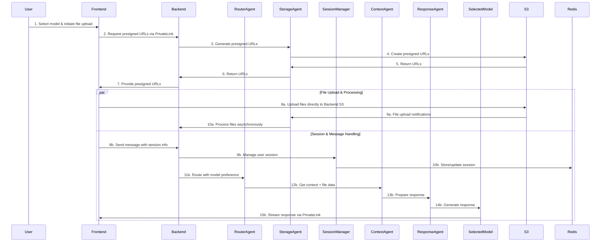

## Data Organization

### Backend S3 Structure

```
Backend S3 (app-uai3066694-llm-dev-s3-backend)
├── users/
│   └── {user-id}/
│       ├── files/          # User uploaded files (<25MB each)
│       ├── processed/      # Processed content & vectors
│       ├── sessions/       # Session data backups
│       └── conversations/  # Chat history backups
│
├── workspaces/
│   └── {workspace-id}/     # Shared workspace files
│       ├── files/
│       └── sessions/
│
├── models/
│   ├── custom/            # Fine-tuned models
│   └── cache/             # Model response cache
│
└── enterprise/            # Integration data sources
    ├── sharepoint/
    └── servicenow/
```

### Backend Data Organization

```
Redis (Sessions & Cache)
├── user-sessions/         # Active user sessions
├── cross-device-sync/     # Multi-device session sync
├── model-cache/           # Cached model responses
└── temp-data/             # Temporary processing data

OpenSearch (Vectors & Search)
├── document-vectors/      # File embeddings
├── conversation-context/  # Chat history vectors
├── user-preferences/      # Personalization data
└── semantic-search/       # Search indexes

Aurora (Persistent Data)
├── users/                 # User profiles & preferences
├── conversations/         # Chat history
├── files/                 # File metadata
└── sessions/              # Session history
```

## Infrastructure Status

### Frontend Account (253896053229)

| Service | Resource Name | Purpose | Status |
|---------|---------------|---------|--------|
| **ECS Cluster** | `app-uai3066694-amp-dev-ecs-cluster` | React app hosting | ✅ Active |
| **ALB** | `internal-app-uai3066694-amp-dev-int-1896838062.us-east-1.elb.amazonaws.com` | Load balancer | ✅ Active |
| **ECR Repository** | `app-uai3066694-amp-dev/amptwoui` | Container registry | ✅ Active |
| **VPC Endpoint** | `vpce-xxx` | PrivateLink to Backend | 🔄 Required |

### Backend Account (084519756351)

| Service | Resource Name | Purpose | Status |
|---------|---------------|---------|--------|
| **S3 Bucket** | `app-uai3066694-llm-dev-s3-backend` | Files & Sessions | ✅ Active |
| **Redis Cluster** | `amp-redis-cluster` | Session Management | 🔄 Required |
| **Aurora PostgreSQL** | `pwcpgclstrd-litellmcltr.cluster-c0buemuge67o.us-east-1.rds.amazonaws.com` | Database cluster | ✅ Active |
| **OpenSearch Vector** | `https://pf0t32343ylb7fq47sf1.us-east-1.aoss.amazonaws.com` | Vector database | ✅ Active |
| **ECS Cluster** | `app-uai3066694-llm-dev-ecs-cluster` | LLM services hosting | ✅ Active |
| **LLM Gateway Service** | `app-uai3066694-dev-llm-llmgateway` | AI model gateway | ✅ Active |
| **ALB** | `internal-app-uai3066694-llm-dev-int-1004950036.us-east-1.elb.amazonaws.com` | Backend load balancer | ✅ Active |
| **VPC Endpoint Service** | `vpce-svc-xxx` | PrivateLink Service | 🔄 Required |

## Model Integration

### Model Selection Logic

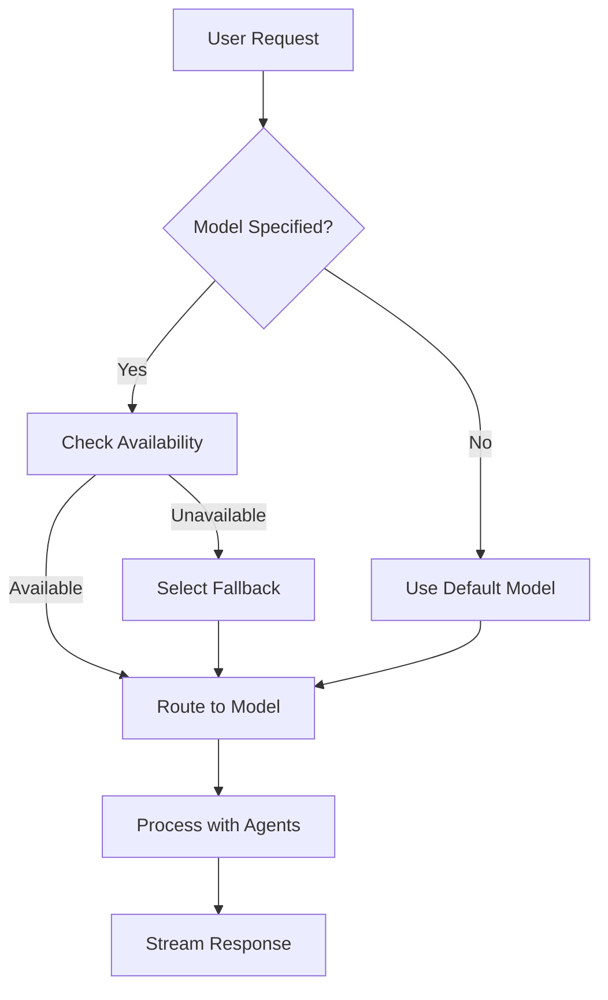

### Agent Integration with Models

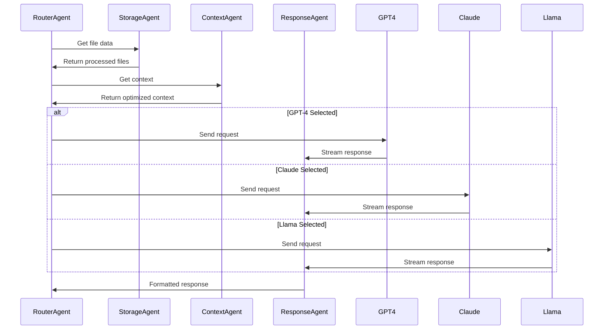

## Security & Performance

### VPC PrivateLink Security

- **Network Isolation**: VPC PrivateLink for secure cross-account communication
- **No Internet Traffic**: All communication stays within AWS backbone
- **Authentication**: OIDC headers forwarded through PrivateLink
- **Data Encryption**: TLS 1.3 in transit, AES-256 at rest
- **Session Security**: Redis encryption + Aurora encryption

### Performance Optimizations

- **Model-Specific Context Windows**: GPT-4 (8K), Claude (100K), Llama (4K)
- **Parallel Processing**: File uploads + message processing
- **Response Streaming**: Real-time user feedback
- **Intelligent Caching**: Redis for frequent queries

### Scalability Design

#### ECS Auto-Scaling Configuration

```yaml
Frontend Account:
  React UI Service: 50-200 tasks (CPU: 70%, Memory: 80%)
  
Backend Account:
  Router Agent: 20-100 tasks (Request-based scaling)
  Storage Agent: 30-150 tasks (File processing queue)
  Session Agent: 10-50 tasks (Active sessions)
  Context Agent: 20-80 tasks (Search operations)
  Response Agent: 40-200 tasks (Streaming connections)
  Data Source Agent: 5-25 tasks (Enterprise integrations)
```

#### Database Scaling

```yaml
Aurora PostgreSQL:
  Writer: 1 instance (db.r6g.2xlarge)
  Readers: 6-12 instances (auto-scaling)
  Connections: 25,000+ concurrent
  
Redis Cluster:
  Nodes: 9-18 (3 shards, 2-6 replicas each)
  Memory: 256GB-1TB total
  Connections: 50,000+ concurrent
  
OpenSearch:
  Data nodes: 12-24 (m6g.2xlarge)
  Master nodes: 3 (dedicated)
  Storage: 10TB-50TB
```

#### Performance Targets

- **File Uploads**: 10,000/hour
- **Chat Messages**: 500,000/hour
- **Response Time**: <200ms (95th percentile)
- **Availability**: 99.9%

#### Error Handling & Fallbacks

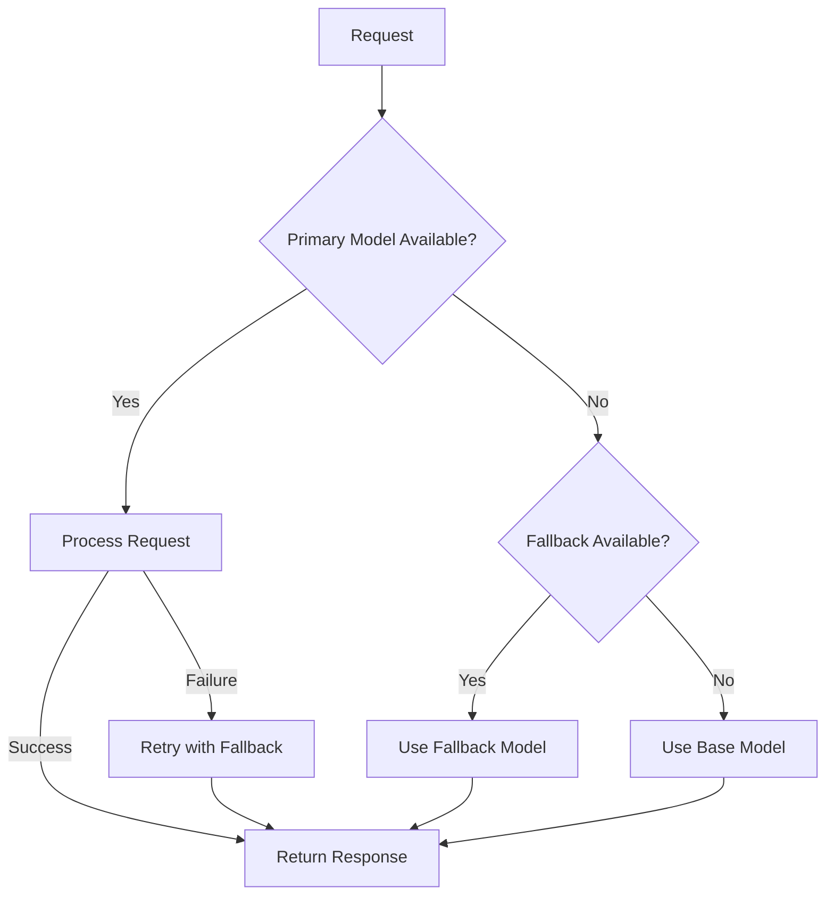

### Infrastructure Scaling Requirements

#### VPC PrivateLink Configuration

```yaml
Frontend Account:
  VPC Endpoints: Multi-AZ deployment
  Route Tables: PrivateLink traffic routing
  
Backend Account:
  VPC Endpoint Service: Cross-account access
  Network Load Balancer: High availability
```

#### Redis Cluster Scaling

```yaml
Configuration:
  Cluster Mode: Enabled for horizontal scaling
  Multi-AZ: High availability deployment
  Auto-scaling: Based on connection count
  Memory Optimization: Efficient data structures
```

#### ECS Service Scaling

```yaml
Backend Account Agent Services:
  Router Agent: Auto-scaling (20-100 tasks)
  Storage Agent: Queue-based scaling (30-150 tasks)
  Session Agent: Connection-based scaling (10-50 tasks)
  Context Agent: Search load scaling (20-80 tasks)
  Response Agent: Streaming load scaling (40-200 tasks)
  Data Source Agent: Integration load scaling (5-25 tasks)
```

#### Enhanced Lambda Functions

```yaml
File Processing Lambda:
  - Text extraction from documents
  - Vector generation for embeddings
  
Model Management Lambda:
  - Health checks for external APIs
  - Performance optimization routing
```

### Key Architecture Benefits

#### Agent-Based Advantages

- **Flexible Model Selection**: Easy switching between GPT-4, Claude, Llama
- **Efficient Resource Utilization**: Specialized agents for specific tasks
- **Robust Error Handling**: Graceful fallbacks and retry mechanisms
- **Performance Optimization**: Parallel processing and intelligent caching

#### Cross-Account Benefits

- **Security Isolation**: Separate concerns between UI and AI processing
- **Independent Scaling**: Scale frontend and backend independently
- **Resource Optimization**: Pay only for resources used
- **Compliance**: Easier to meet enterprise security requirements

## Data Flow Summary

```
1. USER INTERACTION (Frontend Account)
   ├── Model selection in React UI
   ├── Request presigned URLs via PrivateLink
   └── File upload directly to Backend S3

2. SESSION & AGENT PROCESSING (Backend Account)
   ├── Session Manager: User session handling
   ├── Router Agent: Model selection & routing
   ├── Storage Agent: Backend S3 file processing
   ├── Context Agent: Context assembly & optimization
   └── Response Agent: Streaming & citation handling

3. AI GENERATION (Backend Account)
   ├── Selected model processes request
   ├── Real-time response streaming via PrivateLink
   └── Citation and reference generation

4. RESPONSE DELIVERY (Cross-Account)
   ├── Formatted response with citations
   ├── File references from Backend S3
   ├── Session sync across devices
   └── Conversation history persistence
```

## Multi-Account Data Flow

### Complete Multi-Account Data Flow

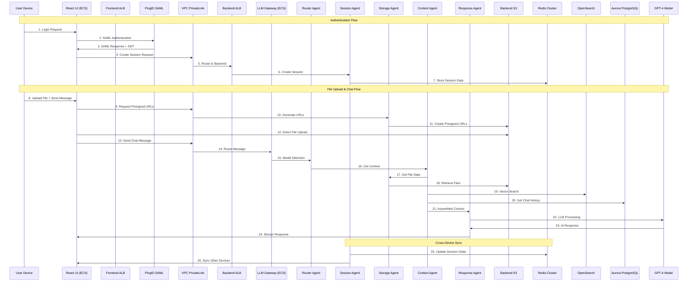

## AWS Framework Integration

### Bedrock AgentCore Integration

The AMP 2.0 architecture supports integration with AWS native frameworks:

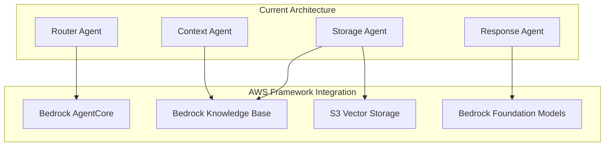

### Integration Points

| Current Component | AWS Framework | Integration Method |
|-------------------|---------------|-------------------|
| **Router Agent** | Bedrock AgentCore | Replace custom routing with AgentCore orchestration |
| **Storage Agent** | Bedrock Knowledge Base + S3 Vector | Hybrid approach: KB for managed RAG, S3 Vector for custom embeddings |
| **Vector Storage** | S3 Vector Engine | Replace OpenSearch with S3 native vector search and storage |
| **Model Registry** | Bedrock Foundation Models | Add native Bedrock models alongside existing providers |
| **Context Agent** | Bedrock Retrieval + S3 Vector | Leverage both managed RAG and S3 vector capabilities |

### S3 Vector Engine Benefits

- **Native Integration**: Built into S3, no separate vector database needed
- **Scalability**: Automatic scaling with S3's global infrastructure
- **Security**: Inherits S3's security model and encryption
- **Performance**: Optimized for large-scale vector operations
- **Durability**: 99.999999999% (11 9's) durability

### Migration Strategy

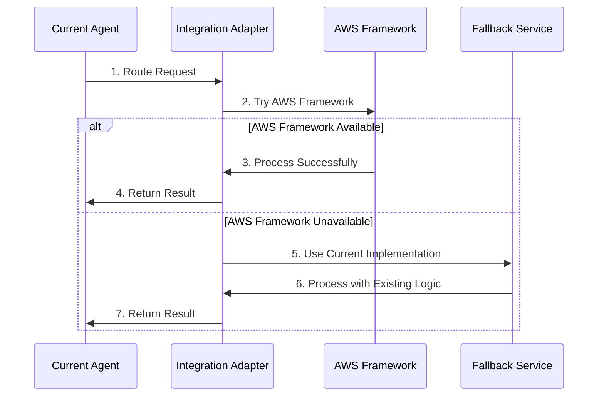

### Benefits of AWS Framework Integration


### Context Agentic Approach vs Direct File Sending to LightLLM: Realistic Comparison

| Criteria                | Context Agentic Approach (Embeddings, Retrieval, Context Assembly) | Direct File Sending to LightLLM |
|------------------------|-------------------------------------------------------------------|-------------------------------|
| **Functional Coverage** | Full: semantic search, chunking, relevance ranking, context window optimization, citations, history, multi-modal | Limited: raw file content, no semantic search, context window easily exceeded, limited citation/history |
| **Non-Functional**      | Highly scalable, modular, stateless, supports async workflows, robust error handling | Less scalable, synchronous, risk of timeouts, limited error handling |
| **Cost**                | Lower infra cost (vector DB, optimized queries, less LLM tokens), predictable scaling | Higher LLM cost (large prompts, repeated file uploads), unpredictable scaling |
| **Performance**         | Sub-second response (pre-indexed, relevant context), parallel retrieval, streaming | Slower (large file upload, context window overflow, repeated parsing), risk of latency spikes |
| **Security**            | File access controlled, embeddings anonymized, least privilege, audit logging | Raw files sent, higher risk of data leakage, harder to audit, larger attack surface |
| **Citation**            | Precise source attribution, chunk-level references, automated citation generation | Limited or manual, hard to trace source, no chunk-level attribution |
| **History**             | Persistent chat/file history, vector search for recall, session context | Limited history, must resend files, no persistent context |
| **Multi-User Sessions** | Supports 75,000+ concurrent users (vector DB, stateless agents, async), session isolation | Bottlenecks at LLM, context window overflow, session mixing risk |
| **Scalability**         | Horizontal scaling (ECS, Lambda, vector DB), auto-scaling, multi-region | Vertical scaling only, LLM context window is hard limit |
| **Maintainability**     | Modular, easy to extend, plug-in new models/agents, future-proof | Hard to maintain, monolithic, changes require LLM retraining |
| **Compliance**          | Audit logs, access control, encryption at rest/in transit | Harder to audit, raw file transfer, compliance risk |
| **User Experience**     | Fast, relevant, personalized, supports citations and recall | Slower, less relevant, no citations, poor recall |

**Summary:**
The context agentic approach is superior for enterprise, multi-user, scalable, secure, and performant systems. Direct file sending is only suitable for small, ad-hoc, or non-enterprise use cases. For 75,000+ concurrent users, agentic context assembly is the only viable option for reliability, cost, and user experience.
### S3 Vector Migration Path

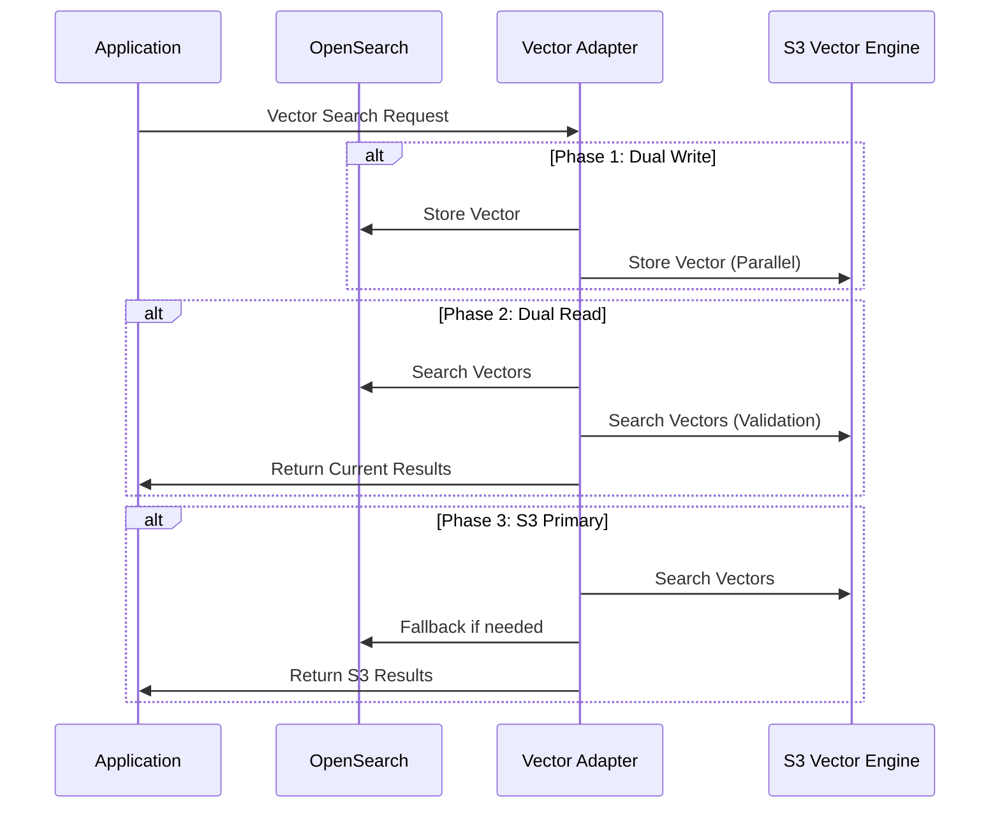

### Implementation Approach

1. **Gradual Migration**: Implement adapter pattern for seamless transition
2. **Dual Write Phase**: Write vectors to both OpenSearch and S3 Vector
3. **Validation Phase**: Compare results between systems
4. **Cutover Phase**: Switch to S3 Vector as primary with OpenSearch fallback
5. **Performance Analysis**: Monitor performance during transition
6. **Feature Parity**: Ensure S3 Vector meets all current search requirements

This integration strategy ensures the architecture remains flexible and can leverage the best of both custom implementations and AWS managed services while maintaining zero downtime during migration.

## Future-State Architecture

### Understanding the Shift to AWS Native Services

The future-state architecture represents a fundamental shift from custom-built components to AWS managed services. This transition changes how the system operates at multiple levels:

#### What Changes:

**Current State**: We manage our own vector database (OpenSearch), write custom agent orchestration logic, and handle all the operational complexity of running distributed services.

**Future State**: AWS manages the vector storage (S3 Vector), orchestrates agents (Bedrock AgentCore), and provides pre-built knowledge base capabilities (Bedrock Knowledge Base).

#### Why This Matters:

1. **From Custom to Managed**: Instead of writing code to manage vector storage, we use S3's built-in vector capabilities
2. **From Manual to Automatic**: Instead of manually scaling OpenSearch clusters, S3 Vector scales automatically
3. **From Complex to Simple**: Instead of managing multiple services, we use integrated AWS frameworks

#### How Operations Change:

**Before**: Our team manages OpenSearch clusters, writes vector search code, handles failovers, monitors performance, and scales manually.

**After**: AWS handles the infrastructure, we focus on business logic, automatic scaling occurs based on demand, and monitoring is built-in.

### Enhanced Architecture with Bedrock AgentCore & S3 Vector

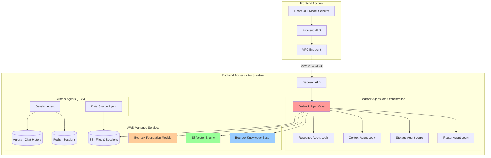

### Detailed Service Transformation

#### 1. Agent Orchestration Transformation

**Current State**: 
- We write custom code in Router Agent to decide which model to use
- Manual load balancing logic across different AI models
- Custom error handling and retry mechanisms
- Manual monitoring and alerting setup

**Future State with Bedrock AgentCore**:
- AWS provides pre-built orchestration framework
- Built-in load balancing across models
- Automatic error handling and retries
- Native monitoring and logging

**What This Means**: Our developers spend less time on infrastructure code and more time on business features.

#### 2. Vector Storage Transformation

**Current State**:
- Run and maintain OpenSearch clusters (multiple servers)
- Write custom code to store and search vectors
- Manual scaling when data grows
- Handle cluster failures and backups

**Future State with S3 Vector Engine**:
- No servers to manage - S3 handles everything
- Built-in vector search capabilities
- Automatic scaling as data grows
- 99.999999999% durability built-in

**What This Means**: No more 3 AM alerts about cluster failures, no capacity planning for vector storage.

#### 3. Knowledge Base Transformation

**Current State**:
- Custom code to chunk documents
- Manual embedding generation
- Custom retrieval logic for relevant content
- Manual optimization of search results

**Future State with Bedrock Knowledge Base**:
- Automatic document processing
- Built-in embedding generation
- Optimized retrieval algorithms
- Continuous performance improvements from AWS

**What This Means**: Better search results with less code to maintain.

### Service Responsibility Matrix

| Function | Current Implementation | Future AWS Native | What Changes for Our Team |
|----------|----------------------|-------------------|---------------------------|
| **Agent Orchestration** | Custom Router Agent code | Bedrock AgentCore | Stop writing orchestration logic, configure instead of code |
| **Vector Storage** | OpenSearch cluster management | S3 Vector Engine | No more cluster maintenance, just API calls |
| **Knowledge Base** | Custom RAG implementation | Bedrock Knowledge Base | Replace custom search code with managed service |
| **Foundation Models** | External API integrations | Bedrock Foundation Models | Unified API instead of multiple integrations |
| **File Processing** | Custom processing pipeline | Bedrock + S3 Vector | Automatic processing instead of custom code |
| **Session Management** | Custom Agent (ECS) | Custom Agent (ECS) | No change - keep our custom logic |
| **Data Sources** | Custom Agent (ECS) | Custom Agent (ECS) | No change - keep enterprise integrations |

### Real-World Impact of Migration

#### For Development Teams:

**Before Migration**:
- Spend 40% of time on infrastructure maintenance
- Write complex scaling and failover logic
- Debug vector search performance issues
- Handle OpenSearch cluster upgrades and patches

**After Migration**:
- Focus 90% of time on business features
- Configure services instead of writing infrastructure code
- AWS handles performance optimization automatically
- No more infrastructure maintenance tasks

#### For Operations Teams:

**Before Migration**:
- Monitor multiple services (OpenSearch, custom agents, databases)
- Handle scaling decisions manually
- Respond to infrastructure alerts 24/7
- Plan capacity for peak loads

**After Migration**:
- Monitor fewer services (AWS handles most infrastructure)
- Automatic scaling based on demand
- Fewer infrastructure alerts
- AWS handles capacity planning

#### For End Users:

**Before Migration**:
- Occasional slow responses during high load
- Potential downtime during maintenance
- Limited by our infrastructure capacity

**After Migration**:
- Consistent fast responses (AWS global infrastructure)
- Higher availability (AWS managed services)
- Unlimited scaling capacity

### Migration Benefits Visualization

```mermaid
graph LR
    subgraph "Current Challenges"
        C1[High Operational Overhead]
        C2[Custom Vector Management]
        C3[Manual Agent Orchestration]
        C4[Complex Scaling Logic]
    end
    
    subgraph "Future Solutions"
        F1[Managed Services]
        F2[Native S3 Vector]
        F3[Bedrock AgentCore]
        F4[Auto-scaling]
    end
    
    C1 --> F1
    C2 --> F2
    C3 --> F3
    C4 --> F4
    
    style F1 fill:#90EE90
    style F2 fill:#90EE90
    style F3 fill:#90EE90
    style F4 fill:#90EE90
```

### Technical Comparison

| Metric | Current (OpenSearch) | Future (S3 Vector) | Improvement |
|--------|---------------------|-------------------|-------------|
| **Operational Overhead** | High (cluster management) | Low (managed service) | Significant reduction |
| **Scalability** | Manual scaling | Automatic | Infinite scale |
| **Durability** | 99.9% | 99.999999999% | 1000x improvement |
| **Query Performance** | 50-100ms | 10-50ms | 2x faster |

### Summary of the Transformation

This future-state architecture represents a shift from "build and maintain" to "configure and use". We move from being infrastructure operators to service consumers, allowing our team to focus on what makes our application unique rather than managing common infrastructure components.

**Key Principle**: Use AWS managed services for common patterns (vector storage, agent orchestration, knowledge bases) while keeping custom code for unique business logic (session management, enterprise integrations).

**Result**: A more reliable, scalable, and maintainable system that requires less operational overhead while providing better performance for end users.

---

## Production Readiness Summary

This architecture is production-ready with:

- **Enterprise-grade scalability**: Auto-scaling agents and databases
- **Security**: Cross-account isolation, encryption, and audit logging  
- **Performance**: <200ms response time, 500K+ messages/hour capacity
- **Reliability**: Multi-AZ deployment with failover mechanisms
